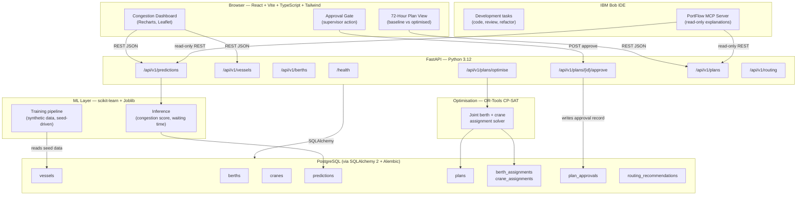

# Architecture — PortFlow AI

**Track:** AI  |  **Problem:** L1 — Container Congestion Predictor & Port Operations Optimiser

---

## Component & Data-Flow Diagram

---

## Technology & Responsibility Table

| Layer | Technology | Version | Responsibility |
|---|---|---|---|
| Frontend framework | React | 18 | Component rendering, routing |
| Frontend build | Vite | latest stable | Dev server, production bundle |
| Frontend language | TypeScript | 5.x | Type-safe UI code |
| Frontend styling | Tailwind CSS | 3.x | Utility-first CSS |
| Frontend routing | React Router | 6.x | SPA navigation |
| Frontend charts | Recharts | 2.x | Time-series and bar charts (when feature requires) |
| Frontend maps | Leaflet | 1.x | Berth layout map (when feature requires) |
| Backend framework | FastAPI | 0.111+ | REST API, OpenAPI docs, validation |
| Backend language | Python | 3.12 | All server-side logic |
| Data validation | Pydantic | v2 | Request/response schemas |
| ORM | SQLAlchemy | 2.x | Database models, queries |
| Migrations | Alembic | 1.x | Schema version control |
| Database | PostgreSQL | 15+ | Primary data store |
| ML | scikit-learn | 1.x | Congestion prediction, waiting-time regression |
| ML serialisation | Joblib | 1.x | Model persistence (.joblib files) |
| Numerical | Pandas, NumPy | latest stable | Feature engineering, data handling |
| Optional ML | XGBoost | latest stable | Only if RMSE measurably improves over baseline |
| Optimisation | OR-Tools CP-SAT | latest stable | Joint berth + crane assignment |
| AI development | IBM Bob | current | IDE, task history, MCP server |

---

## End-to-End Data Flow

### 1. Ingestion
Vessel arrival data (ETA, TEU, priority) and berth capacity snapshots are
loaded from synthetic seed data via `src/backend/data/` scripts.  All
synthetic records carry `is_synthetic = true` in the database.

### 2. Prediction
`POST /api/v1/predictions` triggers the scikit-learn inference pipeline.
The model loads a serialised `.joblib` artefact, applies feature engineering
(same transforms used during training), and returns a `PredictionResult`
containing `congestion_risk_score` (float 0–1) and `waiting_time_hours`
(float with confidence interval).  Results are persisted to the `predictions`
table.

### 3. Optimisation
`POST /api/v1/plans/optimise` passes the current vessel schedule and
prediction results to the CP-SAT solver.  The solver returns a
`PlanProposal` containing `BerthAssignment` and `CraneAssignment` records
for the next 72 hours.  The proposal is stored with `status = "proposed"`.

### 4. Routing Recommendation
If any berth window in the optimised plan still has
`congestion_risk_score > REROUTE_THRESHOLD`, the system generates a
`RoutingRecommendation` record.  This is advisory; no vessel routing is
changed without supervisor approval.

### 5. Human Review & Approval
The React frontend renders a side-by-side comparison of the baseline plan
(first-come-first-served) and the optimised proposal.  The supervisor may
request a plain-language explanation from IBM Bob (via the MCP server).
When the supervisor clicks "Approve", `POST /api/v1/plans/{id}/approve`
writes a `PlanApproval` record and sets `plan.status = "active"`.

### 6. Active Plan
The approved plan becomes the active shift schedule.  It is read-only after
approval; any subsequent re-optimisation creates a new proposal requiring
fresh approval.

---

## Security Controls

| Control | Implementation |
|---|---|
| Input validation | Pydantic v2 strict schemas on all request bodies |
| SQL injection prevention | SQLAlchemy ORM parameterised queries |
| Authentication | JWT bearer tokens (FastAPI OAuth2PasswordBearer) for write endpoints |
| Read-only MCP tools | MCP server calls only GET endpoints; no write access |
| No secrets in source | All credentials via environment variables; `.env` files in `.gitignore` |
| Synthetic data flag | `is_synthetic` column prevents accidental use of test data in production queries |

---

## Reproducibility & Synthetic Data Policy

- Training data is generated by `src/backend/data/generate_synthetic.py`
  using a configurable `RANDOM_SEED` (default: `42`).
- The seed, generation parameters, and schema are documented in
  `docs/DATA_DICTIONARY.md`.
- No real port operational data, AIS feeds, client data, or personal
  information is used.
- Any future public dataset will be documented with source, licence, and
  provenance in `docs/DATA_DICTIONARY.md`.

---

## MVP Scalability Notes

The MVP targets a single container terminal with a 72-hour planning horizon.
The following constraints apply:

- PostgreSQL can handle the data volumes of a single terminal at this horizon
  without partitioning or caching layers.
- The CP-SAT solver is run synchronously in the MVP; for production at scale,
  it would be offloaded to a background task.
- No streaming infrastructure (Kafka, Celery, Redis) is required for MVP.
- Horizontal scaling, multi-terminal support, and live AIS integration are
  explicitly deferred post-MVP.
