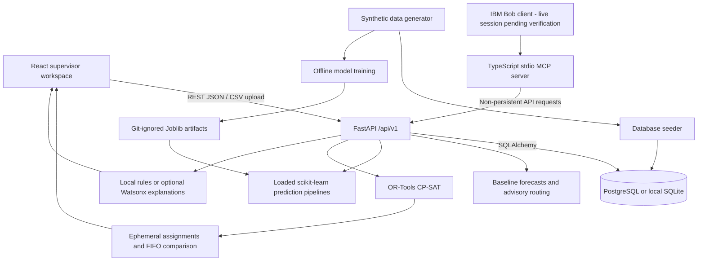

# Architecture — PortFlow AI

## Components and data flow

| Component | Technology | Responsibility |
|---|---|---|
| Frontend | React 18, TypeScript, Vite 6, Tailwind 3, Router 7 | Eight routes, forms, navigation, loading/error states |
| Charts/map | Recharts 3, SVG | Forecasts and berth visualization; no Leaflet dependency |
| API | FastAPI, Pydantic | Validation, resource/schedule reads and data-entry writes |
| Persistence | SQLAlchemy 2, Alembic, PostgreSQL | Six tables: ports, vessels, berths, cranes, vessel_schedules, historical_operations |
| Local database | SQLite | Development/test alternative; automatic local table creation |
| ML | scikit-learn Random Forest pipelines, NumPy, Joblib | Congestion classification and waiting-time regression |
| Optimizer | OR-Tools CP-SAT | Feasible berth/crane assignments and FIFO comparison |
| Copilot | Local rules, optional Watsonx deployment | Explain operational context; fallback without credentials |
| MCP | Node.js, TypeScript, MCP SDK | Risk explanation, waiting context, plan summary tools |

## Actual API paths

All paths are under `/api/v1`: `/health`, `/dashboard/summary`, `/dashboard/congestion`, `/schedules`, `/resources/berths`, `/resources/cranes`, `/scenarios`, `/waiting-times`, `/vessels/{vessel_id}/alternate-routing`, `/copilot/ask`, `/operations-plan`, `/operations-plan/{plan_id}/approve`, and `/data-input/...`. Swagger at `/api/v1/docs` is the runtime contract.

Data entry persists schedules and resource status. Predictions read operational facts. Trained models load once at startup; ML mode returns 503 when artifacts cannot load. Optimization reads the database and returns a computed proposal; it does not persist assignments. Approval acknowledges a UUID ephemerally rather than creating approval tables or activating a schedule. MCP plan-summary calls invoke optimization but do not write database records.

## Trust, security, and scaling limits

Synthetic training results are illustrative, not validated real-port accuracy. Alternate routing is advisory. The language provider does not calculate CP-SAT assignments. IBM integration code is present; live Bob/Watsonx execution and genuine session exports are not established by this review.

Credentials stay in private backend environment settings; frontend variables are public build-time configuration. CORS must allow the deployed frontend origin. Demo data-entry/approval endpoints have no production authentication. Plans are ephemeral; production use requires durable plan storage and access controls. Solver requests consume compute within the requested solve limit; deployment capacity has not been load tested.
